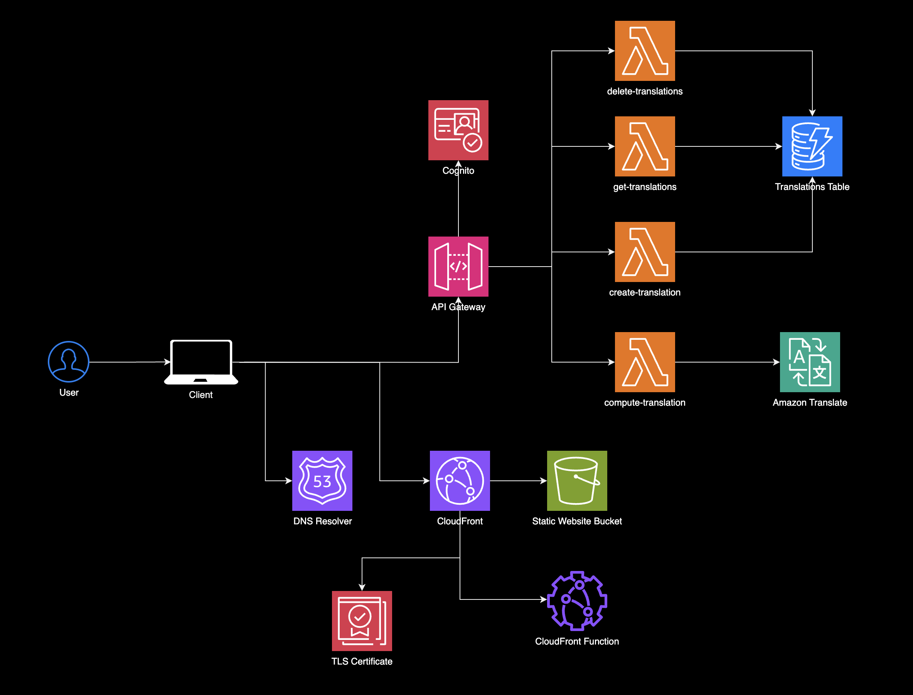

# Verbo 

Verbo Translator is an app that helps users learn new languages by translating text into any of the 72 supported languages. It also provides audio pronunciations and examples of how to use words and phrases in real conversations.

# Architecture Diagram 

## Tech Stack at a Glance
- **Frontend**: TypeScript, Next.js, Tailwind CSS, Shadcn UI, React Hook Form, Zustand
- **Backend**: AWS Lambda, API Gateway, DynamoDB, Cognito, Amazon Translate, Amazon Polly

## Frontend
The frontend is built with Next.js, Zod, react-hook-form, Tailwind CSS, shadcn/ui, and AWS Amplify.

I chose Next.js primarily for its static site generation capabilities, making it perfect for fast, lightweight applications. Its file-based routing keeps things organized and simple to work with.

Zod handles schema validation, allowing me to define schemas and infer TypeScript types easily. It integrates well with react-hook-form, making it straightforward to manage form state and validation.

For styling, Tailwind CSS provides a utility-first approach, enabling me to style quickly and consistently. I’m also using shadcn/ui to build reusable components with encapsulated styles and type-safe variants, ensuring maintainability.

For state management, I’m using Zustand because it’s lightweight, intuitive, and minimizes boilerplate code. It provides a simple, scalable way to manage global state without the complexities of larger libraries, making it a great fit for this project.

Lastly, I selected Amplify Gen 1 v6 for authentication with Cognito, offering a secure and straightforward way to manage user sign-ups and logins while integrating seamlessly with other AWS services.

## In Progress...
This project is still in progress. I'm currently working on adding more features and improving the user experience.